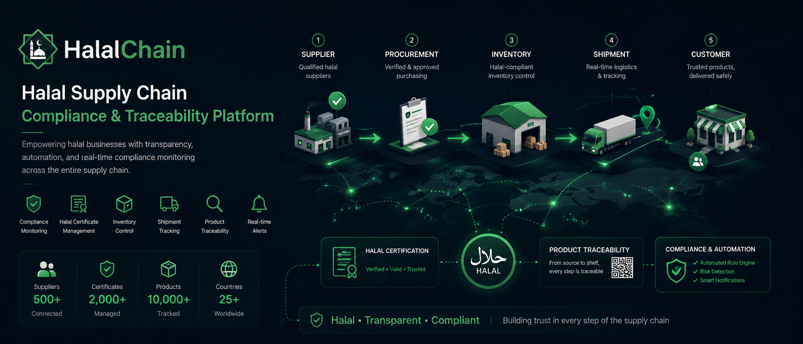

<div align="center">


# HalalChain


**Supply Chain Compliance & Traceability Platform**

Automated compliance monitoring, end-to-end traceability, QR verification, real-time alerts, operational intelligence, and scalable background job processing for modern halal supply chains across Southeast Asia.

[English](#overview) · [Features](#platform-features) · [Architecture](#architecture) · [Quick Start](#quick-start) · [API](#api-overview) · [Contributing](#contributing) · [License](#license)

</div>



### Demo

<p align="center">
  
</p>

---

## Overview

HalalChain is a **compliance-driven automation platform** that monitors, alerts, and scores supply chain health through four key capabilities:

### Product Traceability
Public-facing traceability pages with QR code verification — consumers scan, no login required.

### Compliance Monitoring
Automated certificate expiry detection (30-day window), expired certificate escalation with high-severity alerts, compliance issue tracking, and a transparent **Compliance Score (0–100)**.

### Automation Engine
Four automated rules run daily via cron:

| Rule | Condition | Actions |
|------|-----------|---------|
| **Certificate Expiring** | Expiry within 30 days | Notification + Alert + Email |
| **Certificate Expired** | Expiry date passed | HIGH severity notification + Compliance Issue + Email |
| **Low Inventory** | Stock ≤ reorder level | Notification + Replenishment suggestion |
| **Shipment Delay** | Past due + not delivered | Warning notification + Dashboard indicator |

All rules include **idempotent deduplication** — no duplicate notifications per entity per day.

### Real-time Alerts & Background Processing
- In-app notifications via **Server-Sent Events** (SSE) with 25-second heartbeat
- **WebSocket (Socket.IO)** for real-time shipment tracking and activity streaming
- **BullMQ** queue system for reliable background job processing (emails, notifications, tracking events)
- **Redis** (Upstash managed) for caching, pub/sub, and queue backend
- Fire-and-forget email delivery via **Resend** or **SMTP** with exponential backoff retry (3 attempts)
- Per-user notification preferences

## Platform Features

| Category | Capabilities |
|----------|-------------|
| **Traceability** | Public traceability page, QR-based verification, product journey visualization |
| **Compliance Monitoring** | Certificate expiry detection, expired certificate alerts, compliance issue tracking, compliance scoring (0–100) |
| **Operations Monitoring** | Low inventory detection, shipment delay detection, dashboard alerts, automated notifications |
| **Real-time** | WebSocket (Socket.IO) for shipment tracking, SSE for notifications, BullMQ queues, Redis caching |
| **Platform** | RBAC (ADMIN/MANAGER/STAFF), audit logs (CREATE/UPDATE/DELETE/STATUS_CHANGE), email notifications (Resend/SMTP), real-time updates, dashboard analytics (6-month trends), Swagger API docs, **6-language i18n** with RTL support |

## Architecture

```text
┌──────────────────────────────────────────────────────────────┐
│  Next.js 15 (Frontend) — React 19, Tailwind CSS 4            │
│  /dashboard/*  /settings/*  /traceability/*                  │
└──────────────────────┬───────────────────────────────────────┘
                         │  rewrites: /api/* → backend
                         │            /uploads/* → backend
                         ▼
┌──────────────────────────────────────────────────────────────┐
│  Express 5 (Backend) — TypeScript, Zod validation            │
│  /api/docs (Swagger UI)  /api/health                         │
│  /ws (WebSocket / Socket.IO)                                 │
└──────────────────────┬───────────────────────────────────────┘
                         │
           ┌─────────────┼─────────────┐
           │             │             │
           ▼             ▼             ▼
┌─────────────────┐ ┌─────────────────┐ ┌─────────────────┐
│  Redis 7        │ │  BullMQ Queue   │ │  Socket.IO      │
│  (Upstash)      │ │  (3 queues)     │ │  WebSocket      │
│  - Cache        │ │  - shipments    │ │  - Rooms        │
│  - Pub/Sub      │ │  - notifications│ │  - Real-time    │
│  - Queue backend│ │  - emails       │ │    events       │
└─────────────────┘ └─────────────────┘ └─────────────────┘
                         │
                         ▼
┌──────────────────────────────────────────────────────────────┐
│  Automation Engine (Daily at 08:00)                          │
│  ┌──────────────────────────────────────────────────────┐    │
│  │  Rule Evaluation  →  Condition Check  →  Action       │    │
│  │  ┌────────────────────────────────────────────────┐   │    │
│  │  │ Certificate Expiring  │ Certificate Expired    │   │    │
│  │  │ Low Inventory         │ Shipment Delay         │   │    │
│  │  └────────────────────────────────────────────────┘   │    │
│  │         ↓          ↓           ↓                      │    │
│  │  Notification  +  Alert  +  Email (fire-and-forget)   │    │
│  └──────────────────────────────────────────────────────┘    │
└──────────────────────────┬───────────────────────────────────┘
                            ▼
┌──────────────────────────────────────────────────────────────┐
│  PostgreSQL 16 + Prisma ORM                                  │
│  node-cron — automation rules evaluated daily at 08:00       │
└──────────────────────────────────────────────────────────────┘
```

Monorepo managed with **npm workspaces** (`backend/`, `frontend/`).

## Compliance Score

The Compliance Score (0–100) is computed on-the-fly from 5 transparent factors:

| Factor | Weight | Description |
|--------|--------|-------------|
| Expired Certificates | 30pt | Full penalty if any expired certificate exists |
| Expiring Certificates | 15pt | Full penalty if any cert expires within 30 days |
| Delayed Shipments | up to 20pt | Proportional to delayed/total shipments |
| Low Inventory Items | up to 15pt | Proportional to low-stock/total items |
| Certificate Coverage | up to 20pt | Proportional to suppliers without active certs |

The breakdown is returned with every score so users can see **why** each point was deducted.

## User Roles & Account Management

| Role | Access |
|------|--------|
| **ADMIN** | Full platform access — all modules, user management, audit logs, destructive actions |
| **MANAGER** | Dashboard KPI/reports, analytics, suppliers, products, inventory, warehouses, POs, shipments, certificates |
| **STAFF** | Simplified dashboard, inventory operations (inbound/outbound/adjustment), warehouse read |

Role-based navigation is enforced on both frontend (`src/lib/navigation.ts`) and backend (`authorize` middleware).

**Account statuses:** Users can be `ACTIVE` or `SUSPENDED` — suspended accounts are rejected at login with a clear message. Additional user properties: `isVerified` boolean, `lastLoginAt` timestamp, and `tokenVersion` for forced invalidation.

**Invitation flow:** ADMINs invite new users via email — the invitation includes a role selection (ADMIN/MANAGER/STAFF), an expiry date, and an `accept-invite` page flow.

## Multilingual Support (i18n)

HalalChain is fully internationalised with 6 locale options:

| Locale | Language | Direction | Flag |
|--------|----------|-----------|------|
| `en` | English | LTR | GB |
| `vi` | Tiếng Việt | LTR | VN |
| `ms` | Bahasa Melayu | LTR | MY |
| `id` | Bahasa Indonesia | LTR | ID |
| `ar` | العربية | **RTL** | SA |
| `th` | ไทย | LTR | TH |

Language preference is persisted via cookie (`halalchain_lang`). Includes **RTL layout support** for Arabic. Every UI module (navigation, auth, dashboard, products, suppliers, inventory, warehouses, POs, shipments, certificates, reports, settings, notifications, traceability) has its own namespace for clean translation management.

## Quick Start

### Prerequisites

- Node.js 20+
- Docker (for PostgreSQL + Redis)
- Cloudinary account *(optional — required only for avatar and certificate file uploads)*
- Resend API key or SMTP credentials *(optional — required only for email alerts)*
- Upstash Redis account *(optional — production Redis is configured with Upstash; local Redis via Docker works for development)*

### Setup

```bash
# Clone the repository
git clone https://github.com/AbdolHamidDev/HalalChain.git
cd HalalChain

# Install dependencies
npm install

# Start infrastructure (PostgreSQL + Redis)
npm run db:up

# Configure environment variables
cp backend/.env.example backend/.env
cp frontend/.env.example frontend/.env

# Run database migrations and seed demo data
npm run db:migrate
npm run db:seed

# Start development servers
npm run dev
```

| Service | URL |
|---------|-----|
| Frontend | http://localhost:3000 |
| API | http://localhost:4000 |
| Swagger docs | http://localhost:4000/api/docs |
| WebSocket | ws://localhost:4000/ws |
| Prisma Studio | `npm run db:studio` |

Edit `backend/.env` — at minimum set `JWT_SECRET`. For avatar/certificate uploads, fill in the Cloudinary variables. For email alerts, set either `RESEND_API_KEY` or SMTP variables. For Redis, set `REDIS_URL` (local: `redis://localhost:6379`, or Upstash URL).

### Demo Admin (No Account Required)

Try the admin panel instantly without creating an account:

1. Visit the landing page
2. Click **"Try Demo Admin"** button
3. Instantly access the full admin dashboard

**Demo Credentials** (pre-filled on demo login page):
- Email: `demo-admin@halalchain.local`
- Password: `demo-admin-2024`

**Note:** Demo mode is a temporary session. All changes are stored locally in your browser and are not saved to the database. When you try to add/edit/delete data, you'll see a friendly reminder that this is demo mode.

### Seed Data Accounts

After running `npm run db:seed`, these accounts are created:

| Email | Role | Purpose |
|-------|------|---------|
| admin@halalchain.com | ADMIN | Full platform access |
| manager@halalchain.com | MANAGER | Operations management |
| staff@halalchain.com | STAFF | Inventory operations |
| staff2@halalchain.com | STAFF | Warehouse staff |

**Default seed password:** Set via `SEED_PASSWORD` environment variable in `backend/.env` (falls back to a secure default if not set).

**Important:** After seeding, immediately change the default password for all accounts in production environments.

Seed data creates all automation demo conditions:
- **3 expired certificates** → Rule 2 fires → Compliance Score affected
- **1 certificate expiring in 14 days** → Rule 1 fires
- **2 low-stock inventory items** → Rule 3 fires
- **3 overdue shipments** → Rule 4 fires
- **1 supplier without certificates** → Coverage factor affected

## Project Structure

```text
HalalChain/
├── backend/
│   ├── prisma/              # Schema, migrations, seed
│   └── src/
│       ├── routes/          # 20 REST API route files
│       │   ├── settings/    # Notification preferences, etc.
│       │   └── websocket.ts # WebSocket info endpoint
│       ├── middleware/      # JWT auth + role authorization + WebSocket auth
│       ├── lib/
│       │   ├── automation/  # Automation Engine (Sprint 6)
│       │   │   ├── engine.ts             # Rule orchestrator
│       │   │   ├── types.ts              # Shared types
│       │   │   ├── complianceScore.ts    # 0–100 scoring
│       │   │   └── rules/                # 4 automation rules
│       │   ├── redis.ts      # Redis client (Upstash-ready)
│       │   ├── websocket.ts  # Socket.IO server
│       │   ├── queue.ts      # BullMQ queues (shipments, notifications, emails)
│       │   ├── shipmentTracking.ts # Real-time tracking events
│       │   ├── analyticsService.ts
│       │   ├── notificationService.ts
│       │   ├── notificationStream.ts  # SSE streaming
│       │   ├── emailService.ts        # Resend/SMTP
│       │   ├── scheduler.ts          # Daily cron
│       │   ├── certificateUtils.ts
│       │   ├── qrService.ts
│       │   ├── auditLog.ts
│       │   ├── activityStream.ts
│       │   └── ...
│       └── tests/       # Vitest unit & property-based tests
├── frontend/
│   └── src/
│       ├── app/         # Next.js App Router pages (auth, dashboard, settings, traceability)
│       ├── components/  # UI modules, layout, shadcn/ui, settings
│       ├── lib/         # API client, navigation, SSE hook, WebSocket hook, utils
│       ├── i18n/        # 6-language internationalisation (EN, VI, MS, ID, AR, TH)
│       └── types/       # TypeScript declarations
├── docs/                # Architecture docs, screenshots, demo
│   ├── ENHANCED_ERD.md
│   ├── REALTIME_ARCHITECTURE.md
│   ├── REALTIME_IMPLEMENTATION_SUMMARY.md
│   ├── REALTIME_SETUP_GUIDE.md
│   ├── UI_UX_IMPROVEMENTS.md
│   ├── UPSTASH_REDIS_SETUP.md
│   ├── screenshots/
│   └── demo/
├── markdown/            # Internal design & sprint docs
│   ├── DESIGN.md
│   ├── SPRINT6_PLAN.md
│   └── ADMIN_USER_MANAGEMENT.md
├── docker-compose.yml   # PostgreSQL 16 + Redis 7
└── README.md
```

## API Overview

All protected routes require the `halalchain_token` cookie. Public endpoints live under `/api/public/`.

| Prefix | Purpose |
|--------|---------|
| `/api/auth` | Register, login, logout, token refresh, `/me` |
| `/api/dashboard` | KPI stats + Compliance Score, charts, activity feed |
| `/api/analytics` | Date-range analytics (certificates, inventory, POs, shipments) |
| `/api/suppliers` | Supplier CRUD |
| `/api/supplier-contacts` | Supplier contact management |
| `/api/products` | Product CRUD + traceability + QR |
| `/api/certificates` | Halal certificate CRUD + file upload |
| `/api/inventory` | Stock levels + movements |
| `/api/warehouses` | Warehouse CRUD |
| `/api/warehouse-zones` | Warehouse zone management |
| `/api/batch-lots` | Batch/lot tracking |
| `/api/tags` | Tag management |
| `/api/purchase-orders` | PO workflow + line items |
| `/api/shipments` | Shipment tracking |
| `/api/reports` | Summary + CSV/XLSX/PDF export (6 modules: products, inventory, suppliers, certificates, purchase-orders, shipments) with date-range filtering |
| `/api/notifications` | User notifications (SSE stream + WebSocket) |
| `/api/audit-logs` | Audit trail (ADMIN) |
| `/api/admin/users` | User management (ADMIN) |
| `/api/invitations` | User invite flow (ADMIN) |
| `/api/profile` | Profile (name, email), avatar upload (256×256 WebP via Cloudinary), password change with validation |
| `/api/settings/notifications` | Per-user notification preferences (certificate alerts, inventory alerts, shipment alerts, invitation emails) |
| `/api/public` | Public traceability (no auth) |
| `/ws` | WebSocket endpoint (Socket.IO) — real-time shipment tracking, activity feed, notifications |

**Traceability Engine:** The public traceability endpoint (`/api/public/traceability/:sku`) uses a dedicated engine (`traceabilityEngine.ts`) that builds a chronological timeline of events per product: supplier info → certificates → product details → purchase orders → shipments → inventory movements. All events are sorted ascending by date and returned as a structured JSON timeline.

**Real-time Features:**
- **WebSocket (Socket.IO)**: Room-based shipment tracking, live activity feed, instant notifications
- **SSE (Server-Sent Events)**: Notification stream with 25-second heartbeat
- **BullMQ Queues**: 3 queues for reliable background processing (shipment-tracking, notifications, emails)
- **Redis**: Caching, pub/sub, queue backend (Upstash managed in production)

Full OpenAPI 3 spec: `backend/src/swagger.yaml` — interactive docs at `/api/docs`.

## Enums & Statuses

| Model | Values |
|-------|--------|
| **UserRole** | `ADMIN`, `MANAGER`, `STAFF` |
| **UserStatus** | `ACTIVE`, `SUSPENDED` |
| **SupplierStatus** | `ACTIVE`, `INACTIVE` |
| **PurchaseOrderStatus** | `DRAFT`, `APPROVED`, `SHIPPING`, `RECEIVED`, `CANCELLED`, `PARTIAL` |
| **ShipmentStatus** | `PENDING`, `IN_TRANSIT`, `DELIVERED`, `DELAYED` |
| **InventoryMovementType** | `INBOUND`, `OUTBOUND`, `ADJUSTMENT` |
| **AuditAction** | `CREATE`, `UPDATE`, `DELETE`, `STATUS_CHANGE` |
| **NotificationType** | `LOW_STOCK`, `CERTIFICATE_EXPIRING`, `CERTIFICATE_EXPIRED`, `SHIPMENT_DELAYED`, `SYSTEM`, `COMPLIANCE_ISSUE` |

## Database Schema

```text
User ──┬── InventoryMovement
       ├── Notification
       ├── AuditLog
       ├── RefreshToken
       ├── NotificationPreference
       └── UserInvitation (invitedBy)

Supplier ──┬── Product ──┬── Inventory ── Warehouse
           │             ├── InventoryMovement
           │             └── PurchaseOrderItem
           ├── HalalCertificate
           ├── PurchaseOrder ──┬── PurchaseOrderItem
           │                   └── Shipment
           ├── SupplierContact
           └── Tag

Warehouse ── WarehouseZone

BatchLot ─── (product tracking)
```

## Technical Highlights

| Layer | Technology |
|-------|-----------|
| **Frontend** | Next.js 15, React 19, TypeScript, Tailwind CSS 4, shadcn/ui (Dialog, Select, DropdownMenu, Avatar, Checkbox, Tooltip, Collapsible, Label, Slot, Separator), TanStack React Query, Zustand (state), react-hook-form, Zod, Recharts, Framer Motion, Sonner (toast), next-themes (dark/light), Lucide icons, react-simple-maps, tw-animate-css |
| **Backend** | Express 5, TypeScript, Prisma, Zod, Helmet, JWT + Refresh Tokens, node-cron, Redis (ioredis + Upstash), BullMQ, Socket.IO |
| **Automation** | 4-rule engine, idempotent deduplication, daily cron, SSE + WebSocket streaming |
| **Database** | PostgreSQL 16, Prisma ORM |
| **Email** | Resend (primary) / SMTP (fallback), exponential backoff retry, 3 attempts |
| **File Storage** | Cloudinary (avatars: 256×256 WebP resize, certificate files), multer for upload handling |
| **Auth** | JWT access token (HttpOnly cookie), Refresh Token rotation (bcrypt-hashed), token version invalidation, rate limiter (5 req/min on refresh), user suspension support |
| **Real-time** | Server-Sent Events (SSE) with 25-second heartbeat + WebSocket (Socket.IO) for bidirectional communication |
| **Queue** | BullMQ with Redis backend — 3 queues: shipment-tracking, notifications, emails |
| **Deployment** | Docker Compose, npm workspaces, GitHub Actions CI |

## Scripts

| Command | Description |
|---------|-------------|
| `npm run dev` | Start backend + frontend concurrently |
| `npm run dev:api` | Backend only |
| `npm run dev:web` | Frontend only |
| `npm run db:up` | Start PostgreSQL + Redis (Docker) |
| `npm run db:down` | Stop PostgreSQL + Redis |
| `npm run db:migrate` | Run Prisma migrations |
| `npm run db:seed` | Seed demo data |
| `npm run db:studio` | Open Prisma Studio |
| `npm run test -w backend` | Run backend tests |

## Testing

Backend tests use **Vitest** with unit tests and property-based tests (`fast-check`) for notification deduplication logic.

```bash
npm run test -w backend
```

## Documentation

| Document | Description |
|----------|-------------|
| `docs/ENHANCED_ERD.md` | Enhanced Entity-Relationship Diagram |
| `docs/REALTIME_ARCHITECTURE.md` | Real-time architecture (Redis, WebSocket, BullMQ) |
| `docs/REALTIME_IMPLEMENTATION_SUMMARY.md` | Real-time features implementation summary |
| `docs/REALTIME_SETUP_GUIDE.md` | Step-by-step real-time setup guide |
| `docs/UI_UX_IMPROVEMENTS.md` | Dashboard & certificates UI/UX improvement proposals |
| `docs/UPSTASH_REDIS_SETUP.md` | Upstash Redis configuration & production setup |
| `markdown/SPRINT6_PLAN.md` | Sprint 6 — Compliance & Automation Engine plan |
| `markdown/DESIGN.md` | System design documentation |
| `markdown/ADMIN_USER_MANAGEMENT.md` | Admin user management guide |

## Deployment (planned)

| Layer | Target |
|-------|--------|
| Frontend | Vercel |
| API + DB + Redis | Railway |

Set `NODE_ENV=production`, a strong `JWT_SECRET`, and `FRONTEND_URL` to your production frontend origin. Configure `NEXT_PUBLIC_API_URL` on the frontend to point at the deployed API. For Redis, use Upstash or self-hosted Redis.

## Screenshots

| Compliance Dashboard | Inventory Management |
|:--------------------:|:--------------------:|
|  |  |
| Compliance Score KPI, automation alerts, operational widgets | Stock levels, movements, and automated low-stock detection |

| Product Traceability | User Management |
|:--------------------:|:---------------:|
|  |  |
| Public timeline — no login required | Role-based access with audit logs and invitation flow |

## Roadmap

- [x] Core compliance monitoring & automation engine
- [x] Real-time notifications (SSE + WebSocket)
- [x] Public traceability with QR verification
- [x] Multi-language support (6 languages, RTL)
- [ ] Advanced analytics & predictive insights
- [ ] Mobile application (React Native)
- [ ] Third-party ERP/SCM integrations
- [ ] Blockchain-based certificate verification
- [ ] AI-powered compliance risk assessment

## Contributing

HalalChain is open-source and welcomes contributions from the community.

We appreciate all contributions — whether it's a bug fix, feature implementation, documentation improvement, or design suggestion.

### How to Contribute

1. **Fork** the repository
2. **Clone** your fork: `git clone https://github.com/AbdolHamidDev/HalalChain.git`
3. **Create** a feature branch: `git checkout -b feature/amazing-feature`
4. **Commit** your changes: `git commit -m 'feat: add amazing feature'`
5. **Push** to the branch: `git push origin feature/amazing-feature`
6. **Open** a Pull Request

### Contribution Guidelines

- Follow the existing code style and conventions
- Write clear, descriptive commit messages
- Update documentation for any new features
- Add tests for new functionality
- Ensure all tests pass before submitting PR

### Code of Conduct

This project adheres to a [Code of Conduct](CODE_OF_CONDUCT.md). By participating, you are expected to uphold this code.

### Community

- **Discussions**: [GitHub Discussions](https://github.com/AbdolHamidDev/HalalChain/discussions) — ask questions, share ideas, and connect with other contributors
- **Issues**: [GitHub Issues](https://github.com/AbdolHamidDev/HalalChain/issues) — report bugs or request features
- **Security**: Please report security vulnerabilities to [SECURITY.md](SECURITY.md)

### Recognition

Contributors will be acknowledged in our repository. We value every contribution, no matter how small.

## Support

If you find this project helpful, please consider:

- **Starring** the repository
- **Forking** the repository
- **Sharing** with others who might benefit
- **Joining** discussions and helping others
- **Reporting** bugs and suggesting features

## Sponsorships

If you find this project valuable and would like to support its development, consider buying me a coffee:

<a href="https://buymeacoffee.com/hamidabdol" target="_blank">
  
</a>

Your sponsorship helps maintain and improve HalalChain for the community.

## Acknowledgments

- Built with [Next.js](https://nextjs.org/), [Express](https://expressjs.com/), [Prisma](https://www.prisma.io/), and many other amazing open-source projects
- Icons by [Lucide](https://lucide.dev/)
- UI components by [shadcn/ui](https://ui.shadcn.com/)
- Real-time infrastructure powered by [Socket.IO](https://socket.io/), [BullMQ](https://docs.bullmq.io/), and [Redis](https://redis.io/)

## License

**MIT** — see [LICENSE](LICENSE) for details. You are free to use, copy, modify, merge, publish, distribute, sublicense, and/or sell copies of the software.

---

<div align="center">

**Built for the halal supply chain community**

[Website](https://halalchain.com) · [Documentation](docs/) · [Demo](docs/demo/) · [Report Bug](https://github.com/AbdolHamidDev/HalalChain/issues) · [Request Feature](https://github.com/AbdolHamidDev/HalalChain/issues)

</div>