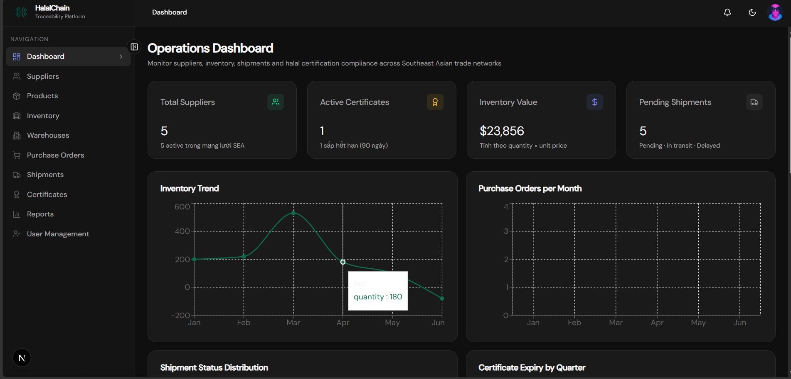
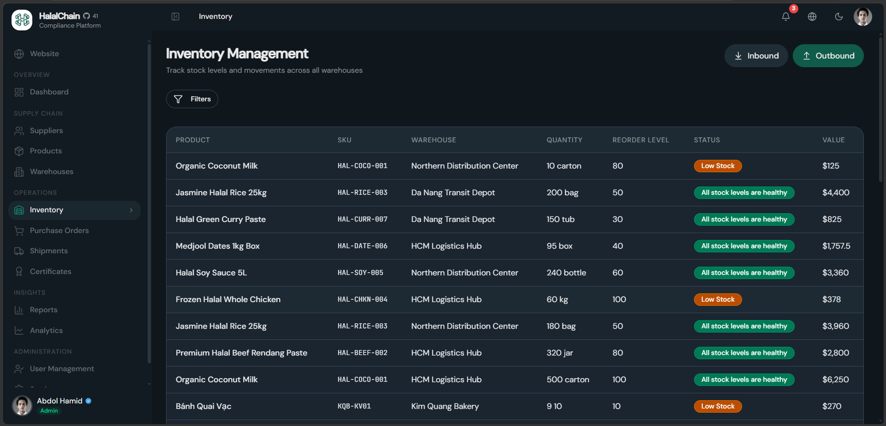
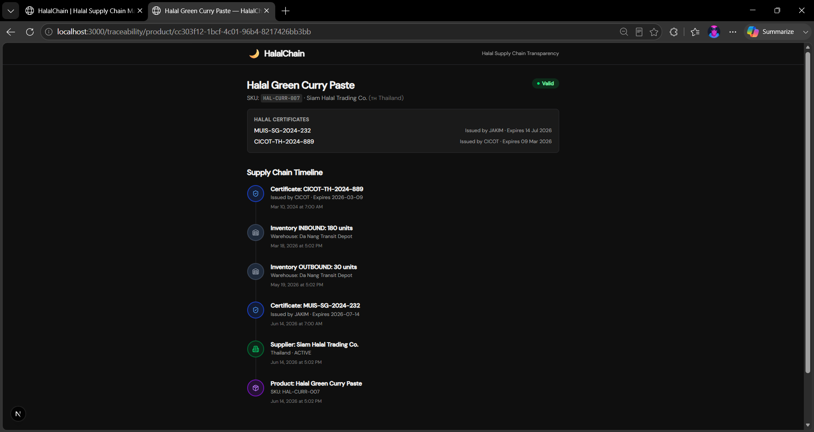
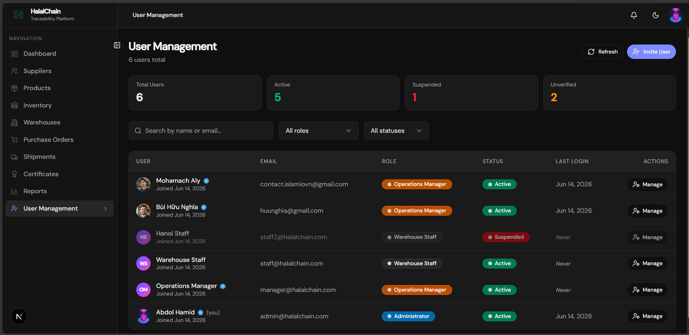

<div align="center">

# HalalChain


**Supply Chain Compliance & Traceability Platform** · **Nền tảng Tuân thủ & Truy xuất Chuỗi Cung ứng Halal**

Automated compliance monitoring, end-to-end traceability, QR verification, real-time alerts, and operational intelligence for modern halal supply chains across Southeast Asia.

[English](#english) · [Tiếng Việt](#tiếng-việt)

</div>

---

## English

### What is HalalChain?

HalalChain is not just a CRUD management system. It is a **compliance-driven automation platform** that monitors, alerts, and scores your supply chain health through four key capabilities:

#### 🔍 Product Traceability
Public-facing traceability pages with QR code verification — consumers scan, no login required.

#### ⚖️ Compliance Monitoring
Automated certificate expiry detection (30-day window), expired certificate escalation with high-severity alerts, compliance issue tracking, and a transparent **Compliance Score (0–100)**.

#### 🤖 Automation Engine
Four automated rules run daily via cron:

| Rule | Condition | Actions |
|------|-----------|---------|
| **Certificate Expiring** | Expiry within 30 days | Notification + Alert + Email |
| **Certificate Expired** | Expiry date passed | HIGH severity notification + Compliance Issue + Email |
| **Low Inventory** | Stock ≤ reorder level | Notification + Replenishment suggestion |
| **Shipment Delay** | Past due + not delivered | Warning notification + Dashboard indicator |

All rules include **idempotent deduplication** — no duplicate notifications per entity per day.

#### 📊 Real-time Alerts
- In-app notifications via **Server-Sent Events** (SSE)
- Fire-and-forget email delivery via **Resend** or **SMTP** with exponential backoff retry
- Per-user notification preferences

### Platform Features

| Category | Capabilities |
|----------|-------------|
| **Traceability** | Public traceability page, QR-based verification, product journey visualization |
| **Compliance Monitoring** | Certificate expiry detection, expired certificate alerts, compliance issue tracking, compliance scoring (0–100) |
| **Operations Monitoring** | Low inventory detection, shipment delay detection, dashboard alerts, automated notifications |
| **Platform** | RBAC (ADMIN/MANAGER/STAFF), audit logs (CREATE/UPDATE/DELETE/STATUS_CHANGE), email notifications (Resend/SMTP), real-time SSE updates, dashboard analytics (6-month trends), Swagger API docs |

### Architecture

```text
┌──────────────────────────────────────────────────────────────┐
│  Next.js 15 (Frontend) — React 19, Tailwind CSS 4            │
│  /dashboard/*  /settings/*  /traceability/*                  │
└──────────────────────┬───────────────────────────────────────┘
                       │  rewrites: /api/* → backend
                       │            /uploads/* → backend
                       ▼
┌──────────────────────────────────────────────────────────────┐
│  Express 5 (Backend) — TypeScript, Zod validation            │
│  /api/docs (Swagger UI)  /api/health                         │
└──────────────────────┬───────────────────────────────────────┘
                       ▼
┌──────────────────────────────────────────────────────────────┐
│  Automation Engine (Daily at 08:00)                          │
│  ┌──────────────────────────────────────────────────────┐    │
│  │  Rule Evaluation  →  Condition Check  →  Action       │    │
│  │  ┌────────────────────────────────────────────────┐   │    │
│  │  │ Certificate Expiring  │ Certificate Expired    │   │    │
│  │  │ Low Inventory         │ Shipment Delay         │   │    │
│  │  └────────────────────────────────────────────────┘   │    │
│  │         ↓          ↓           ↓                      │    │
│  │  Notification  +  Alert  +  Email (fire-and-forget)   │    │
│  └──────────────────────────────────────────────────────┘    │
└──────────────────────────┬───────────────────────────────────┘
                           ▼
┌──────────────────────────────────────────────────────────────┐
│  PostgreSQL 16 + Prisma ORM                                  │
│  node-cron — automation rules evaluated daily at 08:00       │
└──────────────────────────────────────────────────────────────┘
```

Monorepo managed with **npm workspaces** (`backend/`, `frontend/`).

### Compliance Score

The Compliance Score (0–100) is computed on-the-fly from 5 transparent factors:

| Factor | Weight | Description |
|--------|--------|-------------|
| Expired Certificates | 30pt | Full penalty if any expired certificate exists |
| Expiring Certificates | 15pt | Full penalty if any cert expires within 30 days |
| Delayed Shipments | up to 20pt | Proportional to delayed/total shipments |
| Low Inventory Items | up to 15pt | Proportional to low-stock/total items |
| Certificate Coverage | up to 20pt | Proportional to suppliers without active certs |

The breakdown is returned with every score so users can see **why** each point was deducted.

### User Roles

| Role | Access |
|------|--------|
| **ADMIN** | Full platform access — all modules, user management, audit logs, destructive actions |
| **MANAGER** | Dashboard KPI/reports, analytics, suppliers, products, inventory, warehouses, POs, shipments, certificates |
| **STAFF** | Simplified dashboard, inventory operations (inbound/outbound/adjustment), warehouse read |

Role-based navigation is enforced on both frontend (`src/lib/navigation.ts`) and backend (`authorize` middleware).

### Quick Start

#### Prerequisites

- Node.js 20+
- Docker (for PostgreSQL)
- Cloudinary account *(optional — required only for avatar and certificate file uploads)*
- Resend API key or SMTP credentials *(optional — required only for email alerts)*

#### Setup

```bash
npm install
npm run db:up
cp backend/.env.example backend/.env
cp frontend/.env.example frontend/.env
npm run db:migrate
npm run db:seed
npm run dev
```

| Service | URL |
|---------|-----|
| Frontend | http://localhost:3000 |
| API | http://localhost:4000 |
| Swagger docs | http://localhost:4000/api/docs |
| Prisma Studio | `npm run db:studio` |

Edit `backend/.env` — at minimum set `JWT_SECRET`. For avatar/certificate uploads, fill in the Cloudinary variables. For email alerts, set either `RESEND_API_KEY` or SMTP variables.

#### Demo accounts

| Email | Password | Role |
|-------|----------|------|
| admin@halalchain.com | Admin@123 | ADMIN |
| manager@halalchain.com | Admin@123 | MANAGER |
| staff@halalchain.com | Admin@123 | STAFF |
| staff2@halalchain.com | Admin@123 | STAFF |

Seed data creates all automation demo conditions:
- **3 expired certificates** → Rule 2 fires → Compliance Score affected
- **1 certificate expiring in 14 days** → Rule 1 fires
- **2 low-stock inventory items** → Rule 3 fires
- **3 overdue shipments** → Rule 4 fires
- **1 supplier without certificates** → Coverage factor affected

### Project Structure

```text
HalalChain/
├── backend/
│   ├── prisma/          # Schema, migrations (13), seed
│   └── src/
│       ├── routes/      # 16 REST API route files
│       ├── middleware/  # JWT auth + role authorization
│       ├── lib/
│       │   ├── automation/   # Automation Engine (Sprint 6)
│       │   │   ├── engine.ts             # Rule orchestrator
│       │   │   ├── types.ts              # Shared types
│       │   │   ├── complianceScore.ts    # 0–100 scoring
│       │   │   └── rules/                # 4 automation rules
│       │   ├── analyticsService.ts
│       │   ├── notificationService.ts
│       │   ├── notificationStream.ts     # SSE streaming
│       │   ├── emailService.ts           # Resend/SMTP
│       │   ├── scheduler.ts             # Daily cron
│       │   ├── certificateUtils.ts
│       │   ├── qrService.ts
│       │   ├── auditLog.ts
│       │   └── ...
│       └── tests/       # Vitest unit & property-based tests
├── frontend/
│   └── src/
│       ├── app/         # 16 Next.js App Router pages
│       ├── components/  # UI modules, layout, shadcn/ui, settings
│       └── lib/         # API client, navigation, SSE hook, utils
├── docs/screenshots/    # Dashboard, inventory, traceability, users
├── docker-compose.yml   # PostgreSQL 16
└── markdown/            # Internal design & admin docs
```

### API Overview

All protected routes require the `halalchain_token` cookie. Public endpoints live under `/api/public/`.

| Prefix | Purpose |
|--------|---------|
| `/api/auth` | Register, login, logout, token refresh, `/me` |
| `/api/dashboard` | KPI stats + Compliance Score, charts, activity feed |
| `/api/analytics` | Date-range analytics (certificates, inventory, POs, shipments) |
| `/api/suppliers` | Supplier CRUD |
| `/api/products` | Product CRUD + traceability + QR |
| `/api/certificates` | Halal certificate CRUD + file upload |
| `/api/warehouses` | Warehouse CRUD |
| `/api/inventory` | Stock levels + movements |
| `/api/purchase-orders` | PO workflow + line items |
| `/api/shipments` | Shipment tracking |
| `/api/reports` | Summary + CSV/XLSX/PDF export |
| `/api/notifications` | User notifications (SSE stream) |
| `/api/audit-logs` | Audit trail (ADMIN) |
| `/api/admin/users` | User management (ADMIN) |
| `/api/invitations` | User invite flow (ADMIN) |
| `/api/profile` | Profile, avatar upload & password |
| `/api/settings/notifications` | Per-user notification preferences |
| `/api/public` | Public traceability (no auth) |

Full OpenAPI 3 spec: `backend/src/swagger.yaml` — interactive docs at `/api/docs`.

### Database Schema

```text
User ──┬── InventoryMovement
       ├── Notification
       ├── AuditLog
       ├── RefreshToken
       ├── NotificationPreference
       └── UserInvitation (invitedBy)

Supplier ──┬── Product ──┬── Inventory ── Warehouse
           │             ├── InventoryMovement
           │             └── PurchaseOrderItem
           ├── HalalCertificate
           └── PurchaseOrder ──┬── PurchaseOrderItem
                               └── Shipment
```

### Technical Highlights

| Layer | Technology |
|-------|-----------|
| **Frontend** | Next.js 15, React 19, TypeScript, Tailwind CSS 4, shadcn/ui, TanStack React Query, Zod, Recharts, Framer Motion |
| **Backend** | Express 5, TypeScript, Prisma, Zod, Helmet, JWT + Refresh Tokens, node-cron |
| **Automation** | 4 rule engine, idempotent deduplication, daily cron, SSE streaming |
| **Database** | PostgreSQL 16, Prisma ORM |
| **Email** | Resend (primary) / SMTP (fallback), exponential backoff retry, 3 attempts |
| **File Storage** | Cloudinary (avatars: 256×256 WebP, certificate files) |
| **Auth** | JWT access token (HttpOnly cookie), Refresh Token rotation, token version invalidation |
| **Real-time** | Server-Sent Events (SSE) with 25-second heartbeat |
| **Deployment** | Docker Compose, npm workspaces, GitHub Actions CI |

### Scripts

| Command | Description |
|---------|-------------|
| `npm run dev` | Start backend + frontend concurrently |
| `npm run dev:api` | Backend only |
| `npm run dev:web` | Frontend only |
| `npm run db:up` | Start PostgreSQL (Docker) |
| `npm run db:down` | Stop PostgreSQL |
| `npm run db:migrate` | Run Prisma migrations |
| `npm run db:seed` | Seed demo data |
| `npm run db:studio` | Open Prisma Studio |
| `npm run test -w backend` | Run backend tests |

### Testing

Backend tests use **Vitest** with unit tests and property-based tests (`fast-check`) for notification deduplication logic.

```bash
npm run test -w backend
```

### Deployment (planned)

| Layer | Target |
|-------|--------|
| Frontend | Vercel |
| API + DB | Railway |

Set `NODE_ENV=production`, a strong `JWT_SECRET`, and `FRONTEND_URL` to your production frontend origin. Configure `NEXT_PUBLIC_API_URL` on the frontend to point at the deployed API.

### Screenshots

| Compliance Dashboard | Inventory Management |
|:--------------------:|:--------------------:|
|  |  |
| Compliance Score KPI, automation alerts, operational widgets | Stock levels, movements, and automated low-stock detection |

| Product Traceability | User Management |
|:--------------------:|:---------------:|
|  |  |
| Public timeline — no login required | Role-based access with audit logs and invitation flow |

### License

**Proprietary** — all rights reserved. Unauthorized copying, distribution, or use is prohibited.

---

## Tiếng Việt

### HalalChain là gì?

HalalChain không chỉ là một hệ thống quản lý CRUD. Đây là **nền tảng tự động hóa tuân thủ** giám sát, cảnh báo và chấm điểm sức khỏe chuỗi cung ứng của bạn thông qua bốn khả năng chính:

#### 🔍 Truy xuất nguồn gốc sản phẩm
Trang truy xuất công khai với mã QR — người tiêu dùng quét mã, không cần đăng nhập.

#### ⚖️ Giám sát tuân thủ
Phát hiện chứng nhận sắp hết hạn (trong vòng 30 ngày), cảnh báo chứng nhận đã hết hạn với mức ưu tiên CAO, theo dõi vấn đề tuân thủ, và **Điểm Tuân thủ (0–100)** minh bạch.

#### 🤖 Công cụ tự động hóa
Bốn quy tắc tự động chạy hàng ngày qua cron:

| Quy tắc | Điều kiện | Hành động |
|---------|-----------|-----------|
| **Chứng nhận sắp hết hạn** | Hết hạn trong vòng 30 ngày | Thông báo + Cảnh báo + Email |
| **Chứng nhận đã hết hạn** | Ngày hết hạn đã qua | Cảnh báo mức CAO + Vấn đề tuân thủ + Email |
| **Tồn kho thấp** | Số lượng ≤ mức đặt hàng lại | Thông báo + Đề xuất bổ sung |
| **Giao hàng trễ** | Quá hạn + chưa giao | Cảnh báo + Chỉ báo trên dashboard |

Tất cả quy tắc đều có **cơ chế chống trùng lặp** — không có thông báo trùng lặp cho mỗi thực thể mỗi ngày.

#### 📊 Cảnh báo thời gian thực
- Thông báo trong ứng dụng qua **Server-Sent Events** (SSE)
- Gửi email qua **Resend** hoặc **SMTP** với cơ chế thử lại 3 lần

### Tính năng nền tảng

| Danh mục | Khả năng |
|----------|----------|
| **Truy xuất** | Trang truy xuất công khai, xác minh QR, trực quan hóa hành trình sản phẩm |
| **Giám sát tuân thủ** | Phát hiện chứng nhận hết hạn, cảnh báo chứng nhận quá hạn, theo dõi vấn đề tuân thủ, điểm tuân thủ (0–100) |
| **Giám sát vận hành** | Phát hiện tồn kho thấp, phát hiện giao hàng trễ, cảnh báo dashboard, thông báo tự động |
| **Nền tảng** | RBAC (ADMIN/MANAGER/STAFF), audit logs, email, SSE thời gian thực, analytics, Swagger API docs |

### Kiến trúc

```text
┌──────────────────────────────────────────────────────────────┐
│  Next.js 15 (Frontend) — React 19, Tailwind CSS 4            │
│  /dashboard/*  /settings/*  /traceability/*                  │
└──────────────────────┬───────────────────────────────────────┘
                       ▼
┌──────────────────────────────────────────────────────────────┐
│  Express 5 (Backend) — TypeScript, Zod                       │
└──────────────────────┬───────────────────────────────────────┘
                       ▼
┌──────────────────────────────────────────────────────────────┐
│  Automation Engine (Hàng ngày lúc 08:00)                     │
│  ┌──────────────────────────────────────────────────────┐    │
│  │  Đánh giá quy tắc → Kiểm tra điều kiện → Hành động   │    │
│  │  Chứng nhận sắp hết hạn / Đã hết hạn                 │    │
│  │  Tồn kho thấp / Giao hàng trễ                        │    │
│  │  → Thông báo + Cảnh báo + Email                      │    │
│  └──────────────────────────────────────────────────────┘    │
└──────────────────────────┬───────────────────────────────────┘
                           ▼
┌──────────────────────────────────────────────────────────────┐
│  PostgreSQL 16 + Prisma ORM                                  │
└──────────────────────────────────────────────────────────────┘
```

### Tài khoản demo

| Email | Mật khẩu | Vai trò |
|-------|----------|---------|
| admin@halalchain.com | Admin@123 | ADMIN |
| manager@halalchain.com | Admin@123 | MANAGER |
| staff@halalchain.com | Admin@123 | STAFF |
| staff2@halalchain.com | Admin@123 | STAFF |

### Công nghệ

**Frontend:** Next.js 15, React 19, TypeScript, Tailwind CSS 4, shadcn/ui, TanStack React Query, Zod, Recharts, Framer Motion

**Backend:** Express 5, Prisma, PostgreSQL, JWT + Refresh Tokens, Zod, Helmet, node-cron, Cloudinary, Resend

### Giấy phép

**Proprietary (Độc quyền)** — mọi quyền được bảo lưu. Cấm sao chép, phân phối hoặc sử dụng trái phép.